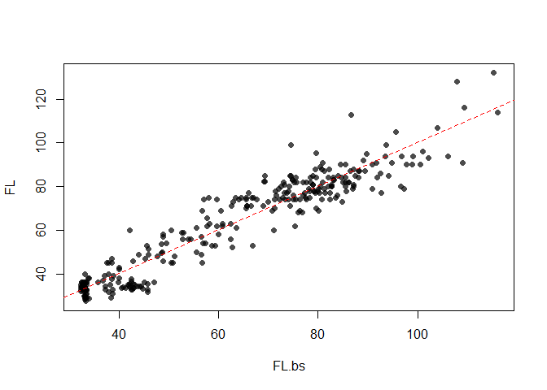

Predicting juvenile salmon forklength from otoliths
================

This is an example of how to reconstruct the forklength (FL) of juvenile Chinook salmon from otolith radius measurements in R. You will need the `segmented` package as we are going to fit a segmented/broken stick regression model.

If you use our training data (294 fall-run juvenile California Central Valley Chinook salmon from various locations) measure otolith radius using the 90 degree transect starting at the most dorsal-posterior primordium (see figure below). Also note that salmon populations from other "Evolutionarily Significant Units" may exhibit significantly different relationships [(Zabel et al. 2010. Environmental Biology of Fishes, 89, p.267-78)](https://link.springer.com/article/10.1007/s10641-010-9678-x)


``` r
library(segmented)
library(scales)
```

Load in the data

``` r
calib = read.csv("https://raw.githubusercontent.com/annasturrock/Oto_size_fish_size_calibration/master/OR_FL_FINALforR.csv")
```

This training data contains otolith radius (OR, microns) and forklength (FL, mm) measurements for 294 Central Valley juvenile fall-run Chinook salmon, as well as the site and year of collection.

``` r
head(calib)
```

    ##   Sample_ID N_LOC                           Site HvW Year  OR     FL
    ## 1     VE554   CNH Coleman National Fish Hatchery   H 2002 246 28.248
    ## 2     VE271   CNH Coleman National Fish Hatchery   H 2002 267 28.711
    ## 3     VE268   CNH Coleman National Fish Hatchery   H 2002 256 28.716
    ## 4     VE234   CNH Coleman National Fish Hatchery   H 2002 261 29.189
    ## 5     VE381   CNH Coleman National Fish Hatchery   H 2002 238 29.263
    ## 6     VE235   CNH Coleman National Fish Hatchery   H 2002 292 29.285

Now subset the data, using only the `ID`, `OR` (otolith radius) and `FL` (fork length) columns.

``` r
calib <- subset(calib, select=c("Sample_ID","OR","FL"))
FL <- calib$FL
OR <- calib$OR
```

We now fixed the y intercept at 30 mm so that size at first feeding reflected literature values (Titus et al 2004). \# Without this action the first segment had a slightly negative slope (an artefact of the patchy calibration data between 25 and 35mm FL).

``` r
forced.intercept <- 30
```

Now fit the segmented regression

``` r
res.lm <- lm(I(FL-forced.intercept) ~ 0 + OR)
res.bs <- segmented(res.lm, seg.Z = ~ 0 + OR)
res.bs
```

    ## Call: segmented.lm(obj = res.lm, seg.Z = ~0 + OR)
    ## 
    ## Meaningful coefficients of the linear terms:
    ##      OR    U1.OR  
    ## 0.01334  0.15989  
    ## 
    ## Estimated Break-Point(s):
    ## psi1.OR  
    ##     264

Having fit the model, we can obtain fitted values as follows

``` r
FL.bs <- predict(res.bs) + forced.intercept
plot(FL.bs,FL, pch = 16, col = alpha("black", 0.7))
abline(0,1, col = "red", lty = "dashed")
```



To show the fitted line, we can order the OR values and plot a line

``` r
plot(FL ~ OR, data = calib, 
    pch = 16, col = alpha("black", 0.7),type = "p", 
    ylab = "Fork length (mm)", 
    xlab = "Otolith radius (µm)", 
    las = 1, cex.lab = 1.3) 
    
points(FL.bs[order(OR)] ~ OR[order(OR)], col = "red", pch = 16, type = "l", lwd = 2.5)
```


We can also calculate the residuals before and after the breakpoint.  

``` r
resid.segm <- FL - FL.bs
resid_small <- resid.segm[OR < res.bs$psi[2]]
resid_large <- resid.segm[OR >= res.bs$psi[2]]
SD1 <- round(sd(resid.segm[OR < res.bs$psi[2]]),2)
SD2 <- round(sd(resid.segm[OR >= res.bs$psi[2]]),2)
```

And then plot those using boxplots. 

We used these residuals to estimate uncertainty around reconstructed forklengths in juvenile and adult salmon, collected as they left freshwater and returned to spawn, respectively. By comparing the same metric (e.g. size at exit from the natal stream) across life stages within a single cohort, otoliths provide a powerful tool to explore patterns in size and time-selective mortality.

``` r
boxplot(resid.segm[OR < res.bs$psi[2]], resid.segm[OR >= res.bs$psi[2]], names = c("Before breakpoint", "After breakpoint"), col = "light grey", 
        las = 1, ylim = c(-25, 27), xlab = "Residual error", outpch=16, outcol=alpha("black", 0.7), ylab = "Residual value", cex.lab = 1.3) #, main = "Broken stick models residuals"
text(1, -25, bquote(~ sigma[r] == .(SD1)))
text(2, -25, bquote(~ sigma[r] == .(SD2)))
text(0.58,25,"B", cex = 2)
```


