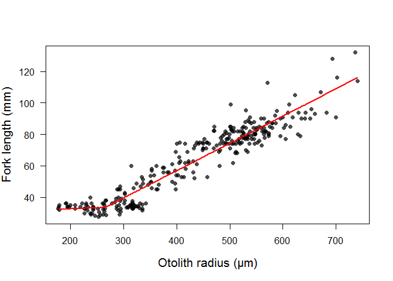

Predicting juvenile salmon forklength using otolith radius
================

This is an example of how to reconstruct the forklength (FL) of juvenile Chinook salmon from otolith radius measurements in R. You will need the `segmented` package as we are going to fit a segmented/broken stick regression model.

If you would like to apply our calibration curve to your own otolith measurements, or use any of our training data (294 fall-run California Central Valley Chinook salmon), be sure to measure otolith radius in the same way - using the 90 degree transect starting at the most dorsal-posterior primordium (see figure below made by George Whitman, Lab Manager of the Johnson Lab at UC Davis). Be careful not to extrapolate beyond the range of values in the training data and be warned that salmon populations from other "Evolutionarily Significant Units" may exhibit significantly different otolith size/fish size relationships [(Zabel et al. 2010. Environmental Biology of Fishes, 89, p.267-78)](https://link.springer.com/article/10.1007/s10641-010-9678-x)


``` r
library(segmented)
library(scales)
```

Load in the training (calibration) data

``` r
calib = read.csv("https://raw.githubusercontent.com/annasturrock/Oto_size_fish_size_calibration/master/OR_FL_FINALforR.csv")
```

This training data contains otolith radius (OR, microns) and forklength (FL, mm) measurements for 294 Central Valley juvenile fall-run Chinook salmon, as well as the site and year of collection.

``` r
head(calib)
```

    ##   Sample_ID N_LOC                           Site HvW Year  OR     FL
    ## 1     VE554   CNH Coleman National Fish Hatchery   H 2002 246 28.248
    ## 2     VE271   CNH Coleman National Fish Hatchery   H 2002 267 28.711
    ## 3     VE268   CNH Coleman National Fish Hatchery   H 2002 256 28.716
    ## 4     VE234   CNH Coleman National Fish Hatchery   H 2002 261 29.189
    ## 5     VE381   CNH Coleman National Fish Hatchery   H 2002 238 29.263
    ## 6     VE235   CNH Coleman National Fish Hatchery   H 2002 292 29.285
    ##                            Source
    ## 1 Sturrock et al. (2015) PLoS ONE
    ## 2 Sturrock et al. (2015) PLoS ONE
    ## 3 Sturrock et al. (2015) PLoS ONE
    ## 4 Sturrock et al. (2015) PLoS ONE
    ## 5 Sturrock et al. (2015) PLoS ONE
    ## 6 Sturrock et al. (2015) PLoS ONE

Now drop unnecessary columns using 'select' within the 'subset' function, then create a 'FL' (forklength) and 'OR' (otolith radius) objects.

``` r
calib <- subset(calib, select=c("Sample_ID","OR","FL"))
FL <- calib$FL
OR <- calib$OR
```

We are now going to fix the y intercept at 30 mm as size at first feeding (~32mm) fitted the data and reflected literature [(Titus et al 2004)](https://www.researchgate.net/publication/288458344_Use_of_otolith_microstructure_to_estimate_growth_rates_of_juvenile_chinook_salmon_from_a_Central_Valley_California_stock).

Without this action the first segment had a slightly negative slope (an artifact of the patchy calibration data between 25 and 35mm FL).

``` r
forced.intercept <- 30
```

Now fit the segmented regression (you first need to fit a normal linear model then use this to fit a broken-stick model)

``` r
res.lm <- lm(I(FL-forced.intercept) ~ 0 + OR)
res.bs <- segmented(res.lm, seg.Z = ~ 0 + OR)
```

Having fit the model, we can obtain fitted values as follows and use 'abline' to add a 1:1 line.

``` r
FL.bs <- predict(res.bs) + forced.intercept
plot(FL.bs,FL, pch = 16, col = alpha("black", 0.7))
abline(0,1, col = "red", lty = "dashed")
```


To show the fitted line, we can order the OR values and plot a line

``` r
plot(FL ~ OR, data = calib, 
    pch = 16, col = alpha("black", 0.7),type = "p", 
    ylab = "Fork length (mm)", 
    xlab = "Otolith radius (µm)", 
    las = 1, cex.lab = 1.3) 
    
points(FL.bs[order(OR)] ~ OR[order(OR)], col = "red", pch = 16, type = "l", lwd = 2.5)
```



We can also calculate the residuals before and after the breakpoint, then plot them using boxplots.

We used these residuals to estimate uncertainty (95% confidence intervals) around reconstructed forklengths from juvenile and adult salmon otoliths, sampled as they left freshwater and returned to spawn, respectively. By comparing the same metric (e.g. size at exit from the natal stream) across life stages within a cohort, otoliths provide a powerful tool to explore patterns in size and time-selective mortality.

``` r
resid.segm <- FL - FL.bs
resid_before <- resid.segm[OR < res.bs$psi[2]]
resid_after <- resid.segm[OR >= res.bs$psi[2]]
SD1 <- round(sd(resid.segm[OR < res.bs$psi[2]]),2)
SD2 <- round(sd(resid.segm[OR >= res.bs$psi[2]]),2)

boxplot(resid.segm[OR < res.bs$psi[2]], 
        resid.segm[OR >= res.bs$psi[2]], 
        names = c("Before breakpoint", "After breakpoint"), 
        xlab = "Residual error", ylab = "Residual value",
        col = "light grey", las = 1, ylim = c(-25, 27), 
        outpch=16, outcol=alpha("black", 0.7), cex.lab = 1.3) 
text(1, -25, bquote(~ sigma[r] == .(SD1)))
text(2, -25, bquote(~ sigma[r] == .(SD2)))
```


